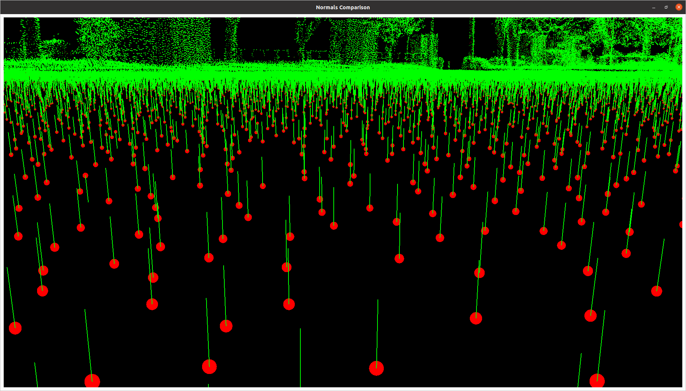
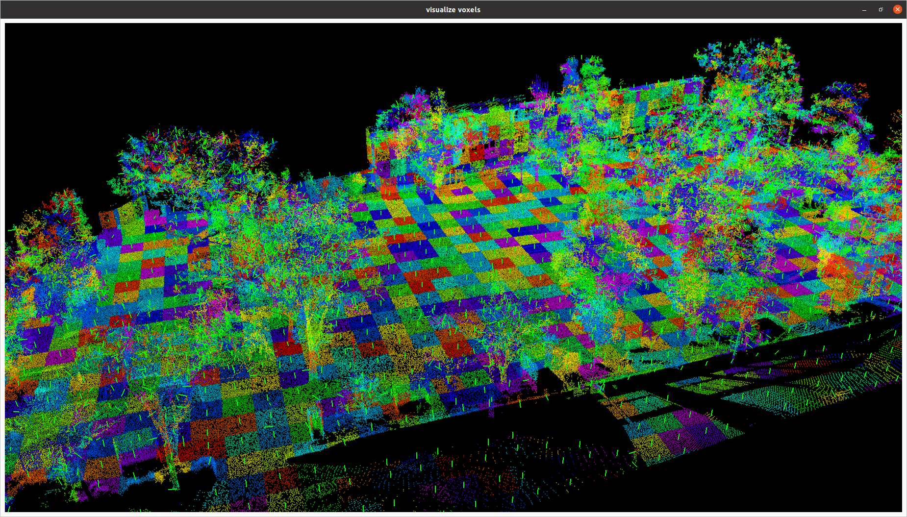

# Point Cloud Registration  

[](https://opensource.org/licenses/MIT) [](https://pypi.org/project/point-cloud-registration/)

`point-cloud-registration` is a **pure Python**, **lightweight**, and **fast** point cloud registration library.  
It outperforms PCL and Open3D's registration in speed while relying **only on NumPy** for computations.

## Features  
✅ **Pure Python** – No compiled extensions, works everywhere  
✅ **Fast & Lightweight** – Optimized algorithms with minimal overhead  
✅ **NumPy-based API** – Seamless integration with scientific computing workflows  

The following registration algorithms are supported, with our **pure Python** `point-cloud-registration` being **even faster than the C++** versions of PCL and Open3D (C++ & Python wrappers).

## Installation  

Install via pip:  

```bash
pip install point-cloud-registration
pip install q3dviewer==1.1.4 # (optional) for visual demo
```

### Current Support Algorithm and Speed Comparison [^1]

| Method                          | Our (sec) | Open3D (sec) | PCL (sec) |
|---------------------------------|-----------|--------------|-----------|
| Point-to-Point ICP              | **0.641** | 1.269        | 8.69      |
| Point-to-Plane ICP [^2]         | **0.522** | 0.710        | 6.64      |
| Voxelized Point-to-Plane ICP    | **0.640** | N/A          | N/A       |
| Normal Distributions Transform (NDT) | **0.872** | N/A          | 19.8      |
| Normal Estimation               | 2.4111    | **1.343**    | 2.68      |

---

[^1]: **Note**: The above times are based on the test data in `data/B-01.pcd` with over 1,000,000 points, licensed under CC BY 4.0. For more information, see `data/README.md`.  

You can benchmark it yourself using the following commands:
```bash
cd benchmark
python3 speed_test_comparison.py # Compare our implementation with Open3D
mkdir build && cd build
cmake .. && make
./speed_test_comparison # Compare with PCL
```

[^2]: Without Normal Estimation

## Usage  

```python
#!/usr/bin/env python3

import numpy as np
from point_cloud_registration import ICP, PlaneICP, NDT, VPlaneICP

# Example point clouds
target = np.random.rand(100, 3)  # Nx3 point numpy array
scan = np.random.rand(80, 3)    # Mx3 point numpy array

icp = VPlaneICP(voxel_size=0.5, max_iter=100, max_dist=2, tol=1e-3)
icp.set_target(target)  # Set the target point cloud
T_new = icp.align(scan, init_T=np.eye(4))  # Fit the scan to the target
print("Estimated Transform matrix:\n", T_new)
```

## Roadmap  
🚀 **Upcoming Features & Enhancements**:  
- [x] **Point-to-Point ICP** – Basic ICP implementation  
- [x] **Point-to-Plane ICP** – Improved accuracy using normal constraints  
- [ ] **Generalized ICP (GICP)** – Handles anisotropic noise and improves robustness  
- [x] **Normal Distributions Transform (NDT)** – Grid-based registration for high-noise environments  
- [ ] **Further optimizations** while staying pure Python  
### Demo

Explore the capabilities of the library with the following demos:

#### Visualize Estimated Normals

Quickly estimate and visualize normals using our fast Python implementation:

```bash
python3 demo_estimate_normals.py
```



#### Visualize Voxels

Visualize 3D voxelization with our efficient Python-based algorithm:

```bash
python3 demo_visualize_voxels.py
```



#### Try Point Cloud Registration

Test the Point Cloud Registration algorithm with a sample demo:

```bash
python3 demo_matching.py
```

### Comparison of Registration Methods

| Method                        | Objective Function*                                         | Data Representation   | Speed         | Precision    |
|-------------------------------|-----------------------------------------------------------|------------------------|---------------|--------------|
| Point-to-Point ICP            | $\sum \| T p_i - q_i \|^2$                                | Point-Based            | Fast          | Moderate     |
| Point-to-Plane ICP            | $\sum \| n_i^T (T p_i - q_i) \|^2$                        | Point-Based (with normals) | Fast | High | 
| Voxelized Point-to-Plane ICP  | $\sum \| n_i^T (T p_i - q_i) \|^2$                        | Voxel-Based (with normals) | Very Fast | High | 
| Generalized ICP (GICP)        | $\sum (T p_i - q_i)^T (C_i^Q + R C_i^P R^T)^{-1} (T p_i - q_i)$ | Point-Based (with covariances) | Moderate | Very High | 
| Normal Distributions Transform (NDT) | $\sum (T p_i - \mu_i)^T \Sigma_i^{-1} (T p_i - \mu_i)$ | Voxel-Based (with covariances) | Very Fast | Moderate |

---

## License  

This project is licensed under the MIT License - see the [LICENSE](LICENSE) file for details.
